# 🔄 Planka MCP Server

**Servidor MCP para integración con tableros Kanban de Planka**

[](https://badge.fury.io/js/@grec0%2Fmcp-planka)
[](https://opensource.org/licenses/MIT)
[](https://www.typescriptlang.org/)

## 📖 Descripción

Planka MCP es un servidor del **Model Context Protocol (MCP)** que permite a asistentes de IA como Claude interactuar directamente con tableros Kanban de [Planka](https://planka.app/). Esta integración facilita la gestión automatizada de proyectos, tareas y flujos de trabajo directamente desde conversaciones con IA.

### 🎯 ¿Qué es MCP?

El **Model Context Protocol** es un estándar abierto que permite a los modelos de IA acceder a herramientas externas y fuentes de datos de manera segura y controlada.

```mermaid
graph TB
    A[🤖 Claude/IA] --> B[📡 MCP Server]
    B --> C[🗂️ Planka API]
    C --> D[📊 Base de Datos]
    
    E[👤 Usuario] --> A
    E --> F[🌐 Planka Web UI]
    F --> C
    
    style A fill:#e1f5fe
    style B fill:#f3e5f5
    style C fill:#e8f5e8
    style D fill:#fff3e0
```



## 🌟 Características Principales

### 📋 Gestión de Proyectos y Tableros
- ✅ Crear, listar y gestionar proyectos
- ✅ Administrar tableros Kanban
- ✅ Configurar listas de trabajo
- ✅ Gestión de membresías y permisos

### 🎫 Gestión Avanzada de Tarjetas
- ✅ Crear tarjetas con descripción detallada
- ✅ Mover tarjetas entre listas
- ✅ Asignar fechas de vencimiento
- ✅ Gestionar etiquetas y categorías
- ✅ Duplicar tarjetas existentes

### ✅ Sistema de Tareas
- ✅ Crear y gestionar subtareas
- ✅ Marcar tareas como completadas
- ✅ Creación masiva de tareas
- ✅ Seguimiento de progreso

### 💬 Comentarios y Colaboración
- ✅ Añadir comentarios a tarjetas
- ✅ Editar y eliminar comentarios
- ✅ Historial de conversaciones

### ⏱️ Seguimiento de Tiempo
- ✅ Cronómetros por tarjeta
- ✅ Iniciar/pausar/resetear tiempo
- ✅ Reportes de tiempo invertido

## 🏗️ Arquitectura del Sistema

```mermaid
flowchart TD
    subgraph "🖥️ Cliente (Claude/Cursor)"
        A[MCP Client]
    end
    
    subgraph "🔧 Servidor MCP"
        B[Server Principal]
        C[Gestor de Herramientas]
        D[Operaciones API]
        E[Validación Zod]
    end
    
    subgraph "🌐 Planka"
        F[API REST]
        G[Base de Datos]
        H[Interfaz Web]
    end
    
    A <==> B
    B --> C
    C --> D
    D --> E
    E --> F
    F --> G
    
    style A fill:#e3f2fd
    style B fill:#f3e5f5
    style C fill:#e8f5e8
    style D fill:#fff3e0
    style E fill:#fce4ec
    style F fill:#e0f2f1
    style G fill:#f1f8e9
    style H fill:#fff8e1
```



## � Instalación Rápida

### 📋 Prerrequisitos

- 🐳 [Docker](https://www.docker.com/get-started) for running Planka
- 🔄 [Git](https://git-scm.com/downloads) for cloning the repository
- 🟢 [Node.js](https://nodejs.org/) (version 18 or above) and npm for development

### 📥 Installation

1. Clone this repository:
```bash
git clone https://github.com/bradrisse/kanban-mcp.git
cd kanban-mcp
```

2. Install dependencies and build the TypeScript code:
```bash
npm install
npm run build
```

3. Start the Planka containers:
```bash
npm run up
```

4. Access the Planka Kanban board:
   - Default URL: http://localhost:3333
   - Default credentials: 
     - Email: demo@demo.demo
     - Password: demo

5. Configure Cursor to use the MCP server:
   - In Cursor, go to Settings > Features > MCP
   - Add a new MCP server with the following configuration:
   ```json
   {
     "mcpServers": {
       "kanban": {
         "command": "node",
         "args": ["/path/to/kanban-mcp/dist/index.js"],
         "env": {
           "PLANKA_BASE_URL": "http://localhost:3333",
           "PLANKA_AGENT_EMAIL": "demo@demo.demo",
           "PLANKA_AGENT_PASSWORD": "demo"
         }
       }
     }
   }
   ```
   - Replace `/path/to/kanban-mcp` with the actual absolute path to your kanban-mcp directory

Alternatively, you can use a project-specific configuration by creating a `.cursor/mcp.json` file in your project root with the same configuration.

For Docker-based deployment and other advanced options, see the [Installation Guide](https://github.com/bradrisse/kanban-mcp/wiki/Installation-Guide).

## 📚 Documentation

### For Users

- [🛠️ Installation Guide](https://github.com/grec0/mcp-planka/wiki/Installation-Guide): How to install and configure Planka MCP
- [📝 Usage Guide](https://github.com/grec0/mcp-planka/wiki/Usage-Guide): How to use Planka MCP with Claude
- [💡 Capabilities and Strategies](https://github.com/bradrisse/kanban-mcp/wiki/Capabilities-and-Strategies): Detailed exploration of MCP server capabilities and LLM interaction strategies
- [⚠️ Troubleshooting](https://github.com/bradrisse/kanban-mcp/wiki/Troubleshooting): Solutions to common issues

### For Developers

- [👨‍💻 Developer Guide](https://github.com/grec0/mcp-planka/wiki/Developer-Guide): Information for developers who want to contribute to or modify Planka MCP
- [📖 API Reference](https://github.com/bradrisse/kanban-mcp/wiki/API-Reference): Detailed documentation of the MCP commands and Planka API integration

## ✨ Features

Planka MCP provides a comprehensive set of features for managing your kanban boards:

### 📂 Project Management
- Create and view projects
- Manage project settings and members

### 📊 Board Management
- Create and view boards within projects
- Customize board settings

### 📋 List Management
- Create and organize lists within boards
- Reorder lists as needed

### 🗂️ Card Management
- Create, update, and delete cards
- Move cards between lists
- Add descriptions, due dates, and labels
- Duplicate cards to create templates

### ⏱️ Time Tracking
- Start, stop, and reset stopwatches
- Track time spent on individual tasks
- Analyze time usage patterns

### ✅ Task Management
- Create and manage tasks within cards
- Mark tasks as complete or incomplete

### 💬 Comment Management
- Add comments to cards for discussion
- View comment history

## 🤖 LLM Interaction Strategies

MCP Kanban supports several workflow strategies for LLM-human collaboration:

1. **🤝 LLM-Driven Development with Human Review**: LLMs implement tasks while humans review and provide feedback
2. **👥 Human-Driven Development with LLM Support**: Humans implement while LLMs provide analysis and recommendations
3. **🧠 Collaborative Grooming and Planning**: Humans and LLMs work together to plan and organize tasks

For more details on these strategies, see the [Capabilities and Strategies](https://github.com/bradrisse/kanban-mcp/wiki/Capabilities-and-Strategies) wiki page.

## 📦 Available npm Scripts

- `npm run build`: Build the TypeScript code
- `npm run build-docker`: Build the TypeScript code and create a Docker image
- `npm run up`: Start the Planka containers (kanban and postgres)
- `npm run down`: Stop all containers
- `npm run restart`: Restart the Planka containers
- `npm run start-node`: Start the MCP server directly with Node (for testing outside of Cursor)
- `npm run qc`: Run quality control checks (linting and type checking)

## 🤝 Contributing

We welcome contributions to Planka MCP! If you'd like to contribute:

1. Check out the [Developer Guide](https://github.com/bradrisse/kanban-mcp/wiki/Developer-Guide) for information on the project structure and development workflow
2. Look at the [open issues](https://github.com/bradrisse/kanban-mcp/issues) for tasks that need help
3. Submit a pull request with your changes

## ⚠️ Troubleshooting

### Connection Issues

If you encounter "MCP error -32000: Connection closed" when trying to connect via Claude Desktop:

1. **Verify Environment Variables**: Ensure both `PLANKA_API_URL` and `PLANKA_TOKEN` are properly set in your MCP configuration
2. **Check Server Build**: Run `npm run build` to ensure the TypeScript is compiled to JavaScript
3. **Test Server Manually**: Use the test script to verify the server starts correctly:
   ```bash
   PLANKA_API_URL=http://localhost:3000 PLANKA_TOKEN=test_token timeout 3s node dist/index.js
   ```
4. **Verify Planka Connection**: Make sure your Planka server is running and accessible at the configured URL

### Common Solutions

- **Server starts but immediately closes**: This usually indicates missing environment variables
- **Transport connection issues**: Ensure the compiled JavaScript file (`dist/index.js`) exists and is up to date
- **Planka API errors**: Verify your Planka server is running and the API token is valid

## 🆘 Support

If you need help with Planka MCP:

1. Check the [Troubleshooting](https://github.com/bradrisse/kanban-mcp/wiki/Troubleshooting) page for solutions to common issues
2. Search the [GitHub issues](https://github.com/bradrisse/kanban-mcp/issues) to see if your problem has been reported
3. Open a new issue if you can't find a solution

## 📜 License

Planka MCP is open-source software licensed under the MIT License. See the [LICENSE](https://github.com/grec0/mcp-planka/blob/main/LICENSE) file for details.

## Servidor MCP

Este proyecto implementa un servidor MCP (Model Context Protocol) que proporciona acceso a funcionalidades de Planka a través de herramientas que pueden ser utilizadas por modelos de lenguaje como Claude.

### Modos de funcionamiento

El servidor MCP puede ejecutarse en dos modos:

1. **Modo stdio** (por defecto): Ideal para la integración con LLMs, utiliza la entrada y salida estándar para la comunicación.
2. **Modo HTTP**: Proporciona endpoints HTTP para interactuar con el servidor, útil para pruebas y desarrollo.

### Variables de entorno

El servidor requiere las siguientes variables de entorno:

- `PLANKA_BASE_URL`: URL base de Planka (por ejemplo, "http://localhost:3000")
- `PLANKA_AGENT_EMAIL`: Email del usuario para autenticación en Planka
- `PLANKA_AGENT_PASSWORD`: Contraseña del usuario para autenticación en Planka
- `MCP_SERVER_TYPE`: Modo de ejecución del servidor ("stdio" o "http")
- `MCP_HTTP_PORT`: Puerto para el servidor HTTP (solo en modo HTTP, por defecto 3001)

### Ejecutar el servidor

#### En Windows:

```bash
# Modo stdio (por defecto)
set PLANKA_BASE_URL=http://localhost:3000
set PLANKA_AGENT_EMAIL=demo@demo.demo
set PLANKA_AGENT_PASSWORD=demo
set MCP_SERVER_TYPE=stdio
node dist/index.js

# Modo HTTP
set PLANKA_BASE_URL=http://localhost:3000
set PLANKA_AGENT_EMAIL=demo@demo.demo
set PLANKA_AGENT_PASSWORD=demo
set MCP_SERVER_TYPE=http
set MCP_HTTP_PORT=3001
node dist/index.js
```

#### En Linux/Mac:

```bash
# Modo stdio (por defecto)
export PLANKA_BASE_URL=http://localhost:3000
export PLANKA_AGENT_EMAIL=demo@demo.demo
export PLANKA_AGENT_PASSWORD=demo
export MCP_SERVER_TYPE=stdio
node dist/index.js

# Modo HTTP
export PLANKA_BASE_URL=http://localhost:3000
export PLANKA_AGENT_EMAIL=demo@demo.demo
export PLANKA_AGENT_PASSWORD=demo
export MCP_SERVER_TYPE=http
export MCP_HTTP_PORT=3001
node dist/index.js
```

### Scripts de prueba

El proyecto incluye varios scripts para probar el servidor:

- `test-server.js`: Prueba el servidor en modo HTTP
- `test-stdio.js`: Prueba el servidor en modo stdio
- `run-mcp.sh` (Linux/Mac): Script para ejecutar el servidor en diferentes modos
- `run-mcp.bat` (Windows): Script batch para ejecutar el servidor en diferentes modos

Para ejecutar las pruebas:

```bash
# Ejecutar prueba en modo HTTP
node test-server.js

# Ejecutar prueba en modo stdio
node test-stdio.js
```

En Linux/Mac, puede usar el script `run-mcp.sh`:

```bash
# Dar permisos de ejecución
chmod +x run-mcp.sh

# Mostrar ayuda
./run-mcp.sh help

# Ejecutar en modo stdio
./run-mcp.sh stdio

# Ejecutar en modo HTTP
./run-mcp.sh http

# Ejecutar pruebas
./run-mcp.sh test
```

En Windows, puede usar el script `run-mcp.bat`:

```batch
# Mostrar ayuda
run-mcp.bat help

# Ejecutar en modo stdio
run-mcp.bat stdio

# Ejecutar en modo HTTP
run-mcp.bat http

# Ejecutar pruebas
run-mcp.bat test
```

### Herramientas disponibles

El servidor MCP proporciona las siguientes herramientas:

1. `mcp_kanban_project_board_manager`: Gestionar proyectos y tableros
2. `mcp_kanban_list_manager`: Gestionar listas
3. `mcp_kanban_card_manager`: Gestionar tarjetas
4. `mcp_kanban_stopwatch`: Gestionar cronómetros para tarjetas
5. `mcp_kanban_label_manager`: Gestionar etiquetas
6. `mcp_kanban_task_manager`: Gestionar tareas
7. `mcp_kanban_comment_manager`: Gestionar comentarios
8. `mcp_kanban_membership_manager`: Gestionar membresías de tableros 